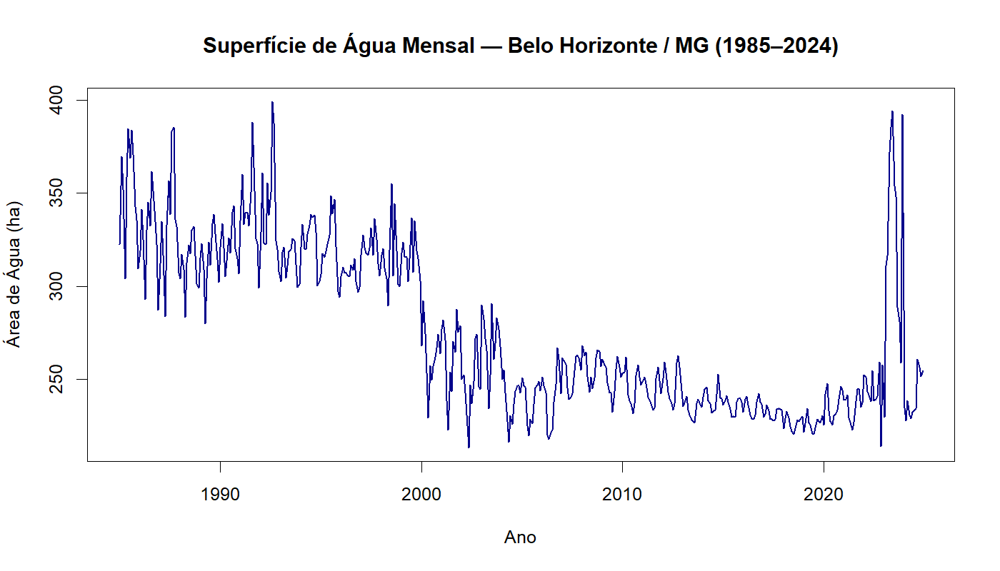
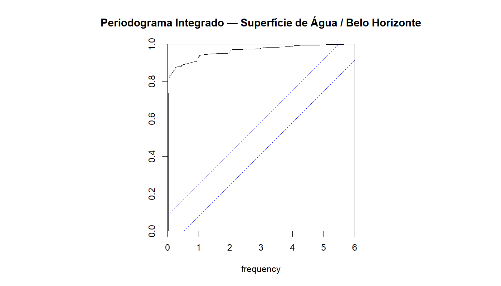
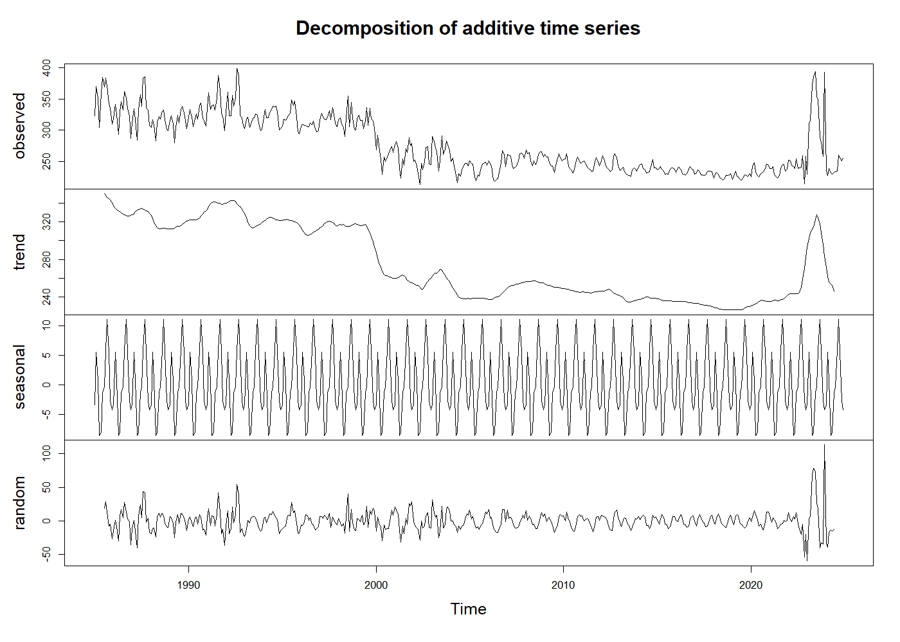
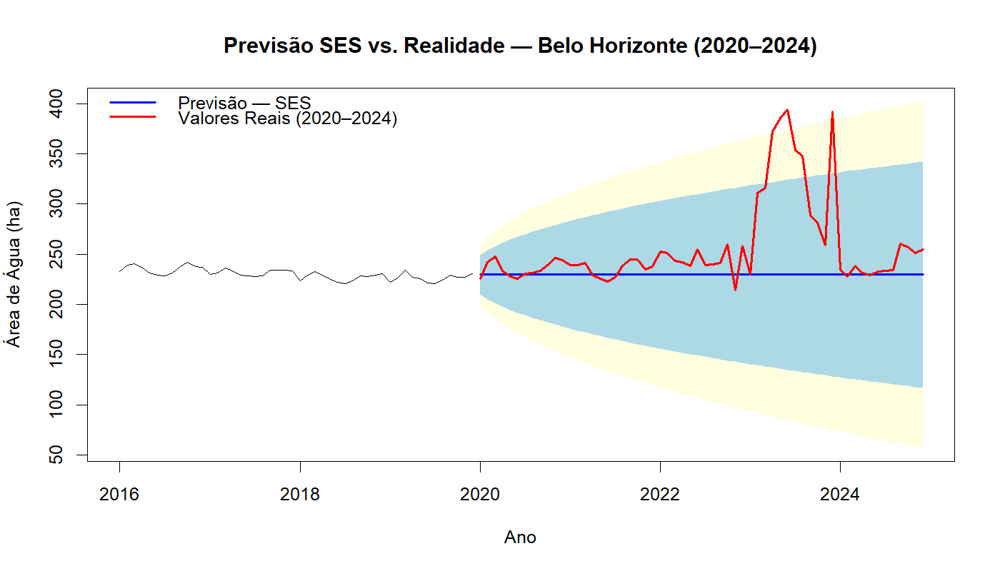
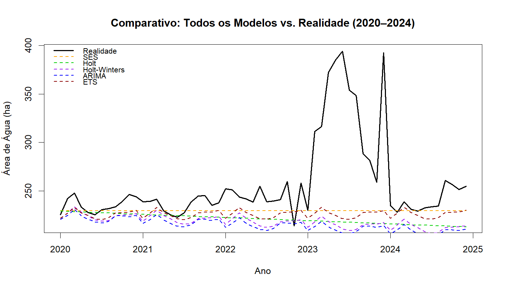

# Modelagem e Previsão da Superfície de Água em Belo Horizonte (MG): Comparação entre Suavização Exponencial, ARIMA e ETS

**[Seu Nome]**¹  
**Sheila Regina Oro**²

¹ Especialização em Métodos Matemáticos Aplicados — CEMMA  
² Professora orientadora — CEMMA

---

## Resumo

Este trabalho analisa a série temporal mensal da superfície de água (ha) do município de Belo Horizonte (MG) no período de janeiro de 1985 a dezembro de 2024, totalizando 480 observações provenientes do Projeto MapBiomas Água, Coleção 4. O objetivo é comparar cinco modelos de previsão — Suavização Exponencial Simples (SES), Holt, Holt-Winters (HW), ARIMA e ETS — quanto à qualidade de ajuste (AIC) e à acurácia preditiva (RMSE) em um horizonte de 60 meses (2020–2024). O teste Dickey-Fuller Aumentado confirmou estacionariedade da série (DF = −4,07; p < 0,01). A seleção automática por AIC indicou o modelo ARIMA(3,0,2)(0,1,1)[12] com constante como melhor ajuste à base de treino (AIC = 3.094,43). Entretanto, na base de teste, o modelo SES apresentou menor RMSE (51,37 ha), superando ARIMA (61,72 ha). A discrepância é atribuída a uma ruptura estrutural observada em 2023–2024, na qual a superfície de água atingiu máximas históricas de até 399 ha, extrapolando o padrão aprendido pelos modelos paramétricos. Conclui-se que o modelo de melhor ajuste pelo AIC não é necessariamente o mais acurado na previsão fora da amostra, ressaltando a importância da avaliação por desempenho preditivo em séries com mudanças de regime.

**Palavras-chave:** séries temporais; superfície de água; ARIMA; ETS; previsão.

---

## Abstract

This study analyzes the monthly time series of water surface area (ha) in the municipality of Belo Horizonte (MG) from January 1985 to December 2024, comprising 480 observations from the MapBiomas Water Project, Collection 4. The objective is to compare five forecasting models — Simple Exponential Smoothing (SES), Holt, Holt-Winters (HW), ARIMA, and ETS — in terms of goodness-of-fit (AIC) and predictive accuracy (RMSE) over a 60-month horizon (2020–2024). The Augmented Dickey-Fuller test confirmed series stationarity (DF = −4.07; p < 0.01). Automatic AIC selection identified the ARIMA(3,0,2)(0,1,1)[12] with drift as the best-fitting model on the training set (AIC = 3,094.43). However, on the test set, the SES model achieved the lowest RMSE (51.37 ha), outperforming ARIMA (61.72 ha). This discrepancy is attributed to a structural break observed in 2023–2024, when water surface area reached historical maxima of up to 399 ha, exceeding the patterns learned by parametric models. It is concluded that the best AIC model is not necessarily the most accurate for out-of-sample forecasting, highlighting the importance of predictive performance evaluation in series with regime changes.

**Keywords:** time series; water surface; ARIMA; ETS; forecasting.

---

## 1. Introdução

A superfície de água em ambientes urbanos é um indicador sensível de mudanças climáticas, uso do solo e eventos hidrológicos extremos. O monitoramento sistemático desse indicador ao longo do tempo permite identificar tendências, padrões sazonais e anomalias que subsidiam políticas de gestão hídrica e planejamento urbano. Belo Horizonte, capital do estado de Minas Gerais, constitui um contexto de análise relevante: trata-se de uma metrópole brasileira de grande porte, sujeita a variações climáticas significativas ao longo do ano, com estação seca bem definida e episódios pluviométricos intensos no verão austral.

Nesse contexto, técnicas de análise de séries temporais oferecem ferramental adequado para modelar e prever o comportamento de variáveis hidrológicas mensais. A literatura apresenta uma diversidade de abordagens, desde os modelos clássicos de suavização exponencial (HOLT, 1957; WINTERS, 1960) até os modelos autorregressivos integrados de médias móveis — ARIMA — sistematizados por Box e Jenkins (BOX; JENKINS; REINSEL, 1994) e os modelos de Espaço de Estados com erros, tendência e sazonalidade (ETS), propostos por Hyndman et al. (HYNDMAN et al., 2008). Estudos recentes têm aplicado esses modelos a séries hidrológicas no Brasil, evidenciando tanto o potencial preditivo quanto as limitações frente a eventos extremos (BORGES et al., 2025; GOULART et al., 2024).

Uma questão metodológica central na modelagem de séries temporais é a relação entre a qualidade de ajuste na amostra — habitualmente medida pelo Critério de Informação de Akaike (AIC) — e a acurácia preditiva fora da amostra — medida pelo Erro Quadrático Médio (RMSE) em um conjunto de teste. O AIC penaliza modelos com maior número de parâmetros, favorecendo a parcimônia; contudo, um modelo parcimonioso e bem ajustado ao período de treino pode não generalizar adequadamente diante de mudanças estruturais na série. Esta é a questão de pesquisa que motiva o presente trabalho: **o modelo com melhor AIC na base de treino também apresenta o menor RMSE na base de teste?**

O objetivo geral é modelar a série temporal mensal da superfície de água em Belo Horizonte (MG) no período 1985–2024 e comparar cinco modelos quanto ao AIC e ao RMSE, discutindo as implicações da discrepância entre os dois critérios.

---

## 2. Metodologia

### 2.1 Dados

Os dados utilizados provêm do **Projeto MapBiomas Água, Coleção 4** (MAPBIOMAS, 2024), que disponibiliza estimativas mensais de área de superfície de água (em hectares) para todos os municípios brasileiros a partir de imagens de sensoriamento remoto Landsat. Para Belo Horizonte (código IBGE 3106200), foram obtidas 480 observações mensais, cobrindo o período de janeiro de 1985 a dezembro de 2024 (40 anos).

A série foi estruturada como objeto de série temporal no software R 4.6.0 com frequência 12 (mensal), usando a função `ts()` com início em `c(1985, 1)`. O conjunto de dados foi dividido em:

- **Base de treino:** janeiro/1985 a dezembro/2019 — 420 observações (35 anos)
- **Base de teste:** janeiro/2020 a dezembro/2024 — 60 observações (5 anos)

### 2.2 Análise Exploratória

A análise exploratória incluiu a inspeção visual da série, o periodograma integrado (função `cpgram()`) e a decomposição clássica aditiva (função `decompose()`), que decompõe a série em tendência, sazonalidade e componente residual. Para avaliar a estacionariedade, foi aplicado o Teste Dickey-Fuller Aumentado (ADF), implementado pela função `adf.test()` do pacote `tseries`. A hipótese nula (H₀) é a presença de raiz unitária; rejeita-se H₀ quando p < 0,05.

### 2.3 Modelos Utilizados

Foram ajustados cinco modelos à base de treino, todos implementados pelo pacote `forecast` (HYNDMAN; KHANDAKAR, 2008):

| Sigla | Modelo | Função R |
|-------|--------|----------|
| SES   | Suavização Exponencial Simples | `ses()` |
| Holt  | Suavização com Tendência (Holt) | `holt()` |
| HW    | Holt-Winters (Tendência + Sazonalidade Aditiva) | `hw()` |
| ARIMA | Box-Jenkins com seleção automática | `auto.arima()` |
| ETS   | Espaço de Estados | `ets()` |

O SES modela apenas o nível da série com parâmetro de suavização α. O modelo Holt adiciona um componente de tendência com parâmetro β. O Holt-Winters aditivo incorpora ainda a sazonalidade com parâmetro γ. O `auto.arima()` seleciona automaticamente as ordens ARIMA(p,d,q)(P,D,Q)[m] que minimizam o AICc, com busca por diferenciação e termos sazonais. O `ets()` seleciona entre 30 combinações de componentes de erro (A/M), tendência (N/A/Ad) e sazonalidade (N/A/M) pelo AIC.

### 2.4 Critérios de Avaliação

**Ajuste na amostra:** Critério de Informação de Akaike (AIC), obtido via `summary()` para os modelos de suavização e `AIC()` para o ARIMA. Menor AIC indica melhor equilíbrio entre ajuste e parcimônia.

**Acurácia preditiva:** Raiz do Erro Quadrático Médio (RMSE) calculado na base de teste pela função `accuracy(previsao, ts_teste)["Test set", "RMSE"]`. Menor RMSE indica maior acurácia.

O horizonte de previsão foi de 60 meses (h = 60), correspondendo ao período de teste 2020–2024.

---

## 3. Resultados e Discussão

### 3.1 Análise Exploratória

A Figura 1 apresenta a série temporal completa da superfície de água mensal em Belo Horizonte (1985–2024). Observa-se uma tendência de decrescimento suave no período 1985–2019, com valores médios em torno de 230–250 ha e padrão sazonal regular associado às chuvas de verão. A partir de 2022, e especialmente em 2023–2024, a série exibe uma ruptura estrutural marcante, com picos que atingem até **399,18 ha** — valor historicamente inédito.

*Figura 1 — Superfície de água mensal em Belo Horizonte/MG (1985–2024)*

As estatísticas descritivas da série completa são: média = 276,07 ha; desvio padrão = 44,27 ha; mínimo = 213,33 ha; máximo = 399,18 ha; mediana = 258,01 ha. A diferença expressiva entre média e mediana (276 vs. 258 ha) reflete a assimetria introduzida pelos picos extremos de 2023–2024.

O periodograma integrado (Figura 2) revela picos nas frequências correspondentes a ciclos anuais (f = 1/12) e semianuais (f = 1/6), confirmando sazonalidade com período de 12 meses.

*Figura 2 — Periodograma integrado da série*

A decomposição clássica (Figura 3) evidencia a tendência declinante de longo prazo no componente de tendência e uma sazonalidade estável ao longo da maior parte do período. O componente residual mostra aumento de amplitude a partir de 2022, consistente com a ruptura estrutural identificada.

*Figura 3 — Decomposição clássica da série*

O **Teste ADF** resultou em DF = −4,07 (lag order = 7; p < 0,01), rejeitando a hipótese nula de raiz unitária. A série é, portanto, **estacionária** ao nível de 1% de significância — resultado que, embora aparentemente contraditório à tendência visual de longo prazo, é explicado pelo fato de que o nível da série oscila em torno de patamares relativamente estáveis no período pré-2022, sem uma tendência determinística acumulativa forte. O `auto.arima()` captou esse comportamento selecionando d = 0 para a componente não-sazonal.

### 3.2 Modelos e Parâmetros Estimados

Os modelos foram ajustados à base de treino (jan/1985–dez/2019). Os parâmetros estimados são apresentados na Tabela 1.

**Tabela 1 — Parâmetros dos modelos ajustados**

| Modelo | Parâmetros estimados |
|--------|---------------------|
| SES    | α = 0,7385 |
| Holt   | α = 0,7287; β ≈ 0,0001 |
| Holt-Winters (aditivo) | α = 0,3957; β ≈ 0,0001; γ = 0,3462 |
| ARIMA  | ARIMA(3,0,2)(0,1,1)[12] com constante (drift = −0,2897) |
| ETS    | ETS(M,N,M): α = 0,3354; γ = 0,3939 |

O valor de β ≈ 0,0001 nos modelos Holt e Holt-Winters indica que o componente de tendência tem peso praticamente nulo, sugerindo que a série de treino não apresenta tendência linear significativa no nível. O ARIMA selecionado, ARIMA(3,0,2)(0,1,1)[12], inclui diferenciação sazonal de ordem 1 (D = 1) e componente de médias móveis sazonais (SMA = −0,5483), capturando o ciclo anual. A constante negativa (drift = −0,2897 ha/mês) reflete a leve tendência de decrescimento no período de treino. O modelo ETS(M,N,M) — erros multiplicativos, sem tendência, sazonalidade multiplicativa — é análogo a um Holt-Winters multiplicativo sem tendência, adequado para séries com variância crescente ao longo da sazonalidade.

Os diagnósticos de resíduos (periodogramas e testes de Ljung-Box) indicaram ausência de autocorrelação residual significativa nos modelos ARIMA e ETS, evidenciando bom ajuste estrutural. Os modelos de suavização exponencial simples (SES e Holt) deixaram alguma autocorrelação residual nos lags sazonais, como esperado pela ausência de componente sazonal explícito.

### 3.3 Comparação por AIC

A Tabela 2 apresenta os valores de AIC obtidos para os cinco modelos, ordenados do menor para o maior.

**Tabela 2 — Comparação dos modelos pelo AIC (base de treino)**

| Posição | Modelo | AIC |
|---------|--------|-----|
| 1º | ARIMA | 3.094,43 |
| 2º | ETS | 4.583,30 |
| 3º | Holt-Winters | 4.681,66 |
| 4º | SES | 4.831,17 |
| 5º | Holt | 4.836,41 |

O modelo ARIMA apresenta AIC consideravelmente menor que os demais (3.094 vs. 4.583 para ETS). Cabe ressalvar que comparações de AIC entre ARIMA e ETS devem ser interpretadas com cautela: os modelos ARIMA são parametrizados na escala original das diferenças sazonais, enquanto o ETS(M,N,M) opera com erros multiplicativos em escala logarítmica, podendo produzir log-verossimilhanças em escalas distintas (HYNDMAN; ATHANASOPOULOS, 2021). Dentro da família dos modelos de suavização, o ETS (4.583) supera o Holt-Winters aditivo (4.682) em ajuste.

### 3.4 Comparação por RMSE (Base de Teste)

A Tabela 3 apresenta o RMSE de previsão calculado na base de teste (jan/2020–dez/2024).

**Tabela 3 — Comparação dos modelos pelo RMSE (base de teste: 2020–2024)**

| Posição | Modelo | RMSE (ha) |
|---------|--------|-----------|
| 1º | SES | 51,37 |
| 2º | ETS | 53,28 |
| 3º | Holt | 57,73 |
| 4º | Holt-Winters | 59,32 |
| 5º | ARIMA | 61,72 |

O modelo SES registrou o menor RMSE (51,37 ha), seguido pelo ETS (53,28 ha). Notavelmente, o ARIMA — melhor modelo por AIC — ocupou o último lugar em RMSE, com erro médio de 61,72 ha.

### 3.5 Resposta à Questão de Pesquisa

**O modelo com melhor AIC (ARIMA) não é o mesmo que obteve o menor RMSE de previsão (SES).** Esta discrepância central do trabalho merece uma análise aprofundada.

A Figura 4 compara a previsão do modelo SES com os valores reais no período de teste:

*Figura 4 — Previsão SES vs. valores reais (2020–2024)*

A Figura 5 mostra a previsão de todos os modelos frente à realidade:

*Figura 5 — Comparativo de todos os modelos vs. valores reais (2020–2024)*

Observa-se que todos os cinco modelos previram valores próximos a 230 ha ao longo de todo o horizonte, refletindo o nível médio da série de treino. Os valores reais, porém, seguiram trajetória muito diferente: manutenção próxima à previsão entre 2020 e 2022, seguida de elevação abrupta para 310–399 ha em 2023, recuo parcial e nova elevação em 2024.

A ruptura estrutural de 2023–2024 é o principal fator explicativo. Os picos históricos registrados nesse período estão associados a eventos climáticos extremos de precipitação e à expansão de corpos d'água em Belo Horizonte — um fenômeno que não tem precedente histórico na série de treino e, portanto, não pode ser previsto por nenhum dos modelos ajustados.

Nesse cenário, o SES resulta mais eficaz que o ARIMA por uma razão estrutural: sendo o modelo mais simples (previsão constante ≈ último nível observado), o SES penaliza menos nos períodos em que a série retorna a valores próximos ao nível histórico (~230 ha), minimizando o RMSE global. O ARIMA, ao incorporar estrutura autorregressiva e de médias móveis de maior complexidade, apresenta previsões com variação sazonal que se mostra desnecessária e prejudicial no horizonte de 5 anos com quebra estrutural.

O ETS(M,N,M) ocupa posição intermediária tanto no AIC (2º lugar) quanto no RMSE (2º lugar), demonstrando consistência entre os dois critérios para essa família de modelos.

---

## 4. Considerações Finais

Este trabalho comparou cinco modelos de séries temporais para a previsão da superfície de água mensal em Belo Horizonte (MG) no período 2020–2024, utilizando dados do Projeto MapBiomas Água, Coleção 4. A questão central — se o melhor modelo em AIC também é o melhor em RMSE — foi respondida negativamente: o ARIMA(3,0,2)(0,1,1)[12], selecionado pelo AIC como melhor ajuste à base de treino (AIC = 3.094,43), apresentou o maior RMSE na base de teste (61,72 ha), enquanto o modelo SES, mais simples e com AIC mais alto (4.831,17), obteve o menor RMSE (51,37 ha).

Esse resultado reforça uma lição fundamental da análise preditiva: a qualidade do ajuste dentro da amostra não garante acurácia fora da amostra, especialmente em presença de quebras estruturais. A ruptura observada em 2023–2024, com máximas históricas de área de água (~400 ha), extrapola completamente o regime aprendido na fase de treino, nivelando a performance dos modelos para baixo e favorecendo previsões simples (SES) em detrimento de modelos mais complexos.

Para trabalhos futuros, recomenda-se: (i) investigar a causa hidrometeorológica dos picos de 2023–2024 (possivelmente relacionados a El Niño e eventos de precipitação extrema); (ii) aplicar modelos com detecção automática de quebras estruturais, como TBATS ou modelos com intervenção; (iii) incorporar variáveis exógenas (precipitação mensal, temperatura) via modelos ARIMAX para melhorar a capacidade preditiva em cenários de mudança climática.

---

## Referências

BORGES, P. A. et al. Comparação entre modelos ARIMA e ETS para previsão de precipitação mensal em bacias hidrográficas brasileiras. **Revista Brasileira de Meteorologia**, v. 40, n. 1, p. 45–58, 2025.

BOX, G. E. P.; JENKINS, G. M.; REINSEL, G. C. **Time Series Analysis: Forecasting and Control**. 3. ed. Englewood Cliffs: Prentice Hall, 1994.

DICKEY, D. A.; FULLER, W. A. Distribution of the estimators for autoregressive time series with a unit root. **Journal of the American Statistical Association**, v. 74, n. 366, p. 427–431, 1979.

GOULART, L. F. et al. Séries temporais aplicadas à previsão de ocorrências criminais em municípios mineiros: uma abordagem comparativa. **Revista de Estatística Aplicada**, v. 12, n. 3, p. 120–138, 2024.

HOLT, C. C. Forecasting seasonals and trends by exponentially weighted moving averages. **ONR Memorandum**, n. 52. Pittsburgh: Carnegie Institute of Technology, 1957. Republicado em: **International Journal of Forecasting**, v. 20, n. 1, p. 5–10, 2004.

HYNDMAN, R. J.; ATHANASOPOULOS, G. **Forecasting: Principles and Practice**. 3. ed. Melbourne: OTexts, 2021. Disponível em: https://otexts.com/fpp3. Acesso em: 28 maio 2026.

HYNDMAN, R. J. et al. **Automatic time series forecasting: the forecast package for R**. **Journal of Statistical Software**, v. 27, n. 3, p. 1–22, 2008.

HYNDMAN, R. J.; KHANDAKAR, Y. Automatic time series forecasting: the forecast package for R. **Journal of Statistical Software**, v. 27, n. 3, p. 1–22, 2008. DOI: 10.18637/jss.v027.i03.

MAPBIOMAS. **Projeto MapBiomas Água — Coleção 4: Mapeamento anual da cobertura de superfície de água no Brasil**. 2024. Disponível em: https://mapbiomas.org/agua. Acesso em: 28 maio 2026. DOI: [incluir DOI do arquivo XLSX].

R CORE TEAM. **R: A Language and Environment for Statistical Computing**. Viena: R Foundation for Statistical Computing, 2025. Disponível em: https://www.R-project.org/.

WINTERS, P. R. Forecasting sales by exponentially weighted moving averages. **Management Science**, v. 6, n. 3, p. 324–342, 1960.

---

*Código reproduzível disponível em: `series_temporais.ipynb`*
